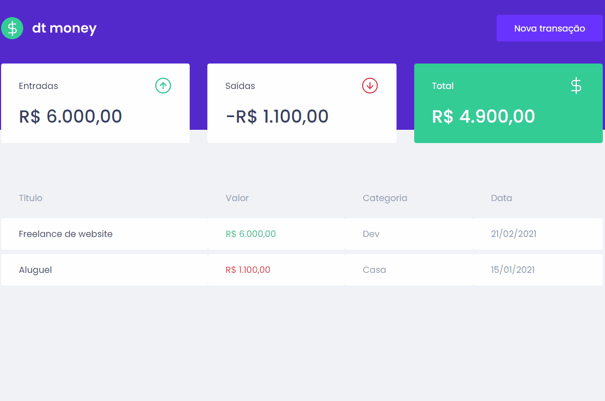

# Dt.Money

<h1 align="center">
  
</h1>

## 💻 Projeto

O dtmoney é uma aplicação para controlar suas finanças pessoais. Desenvolvido durante as aulas do Chapter II da trilha de ReactJS do Bootcamp Ignite da Rocketseat.

## 🚀 Tecnologias, Hooks e Bibliotecas

Esse projeto está sendo desenvolvido com as seguintes tecnologias:

- ReactJS
- TypeScript
- Styled Components
- useState
- useEfect
- Context API
- Axios
- Mirage JS
- Polished
- React Modal

